# Replicating: "Network Load Balancing with In-network Reordering Support for RDMA"

**Team Members:**  
Malak Mohamed Zaki Hassan Matar (malakmohamed.matar@mail.polimi.it)

---

**Source Paper:**  
Cha Hwan Song, Xin Zhe Khooi, Raj Joshi, Inho Choi, Jialin Li, Mun Choon Chan. “Network Load Balancing with In-network Reordering Support for RDMA.” In ACM SIGCOMM '23, September 10–14, 2023, New York, NY, USA. ACM.


**Project:**  
[ConWeave reproduction and HPC extension](https://github.com/malakmatar/Load-Balancing-for-RDMA-Reproduction)

---

# 1. Introduction

Load balancing traffic across a data center network is a well-studied but still unsolved problem. Most modern topologies (e.g., leaf-spine) provide multiple equal-cost paths between any two racks, and the classic way to spread traffic across them is Equal-Cost Multi-Path (ECMP) where each packet's header fields are hashed and the hash is used to pick one of the available paths. Because the hash is fixed per flow, every packet of a flow always takes the same path, which guarantees in-order delivery but also means ECMP has no way to react when several large flows happen to collide on the same link and it distributes load poorly whenever traffic is skewed.

Flowlet switching was proposed to fix this without breaking packet ordering. A flowlet is a burst of packets separated from the next burst by an idle gap and if that gap is long enough, two consecutive bursts of the same flow can safely be sent down different paths without arriving out of order at the receiver. The catch is that this only works if such gaps actually exist in the traffic. TCP tends to produce them (bursty transmission, delayed/batched ACKs), but RDMA does not. RNICs pace packets at line rate as a continuous stream with very small gaps, so flowlet-based schemes like LetFlow rarely find a safe opportunity to reroute. They are left with a bad trade-off: either use a large inactivity threshold and reroute so rarely that load balancing barely happens, or use a small threshold and risk reordering packets, which RDMA handles very badly.

The gap the paper's authors identified is that existing load balancing schemes were designed with TCP's traffic pattern and TCP's tolerance for out-of-order delivery in mind, not RDMA's. RoCEv2 (RDMA over Converged Ethernet) assumes that the network is lossless and delivers packets in order. When an RNIC sees a packet arrive out of order, it can only interpret this as packet loss, and it reacts by cutting its sending rate and triggering loss recovery even if no packet was actually dropped. By contrast, TCP can handle some out-of-order packets without immediately reacting. This makes RDMA highly sensitive to reordering, and the paper shows experimentally that even a single reordered packet noticeably hurts flow completion time.

> **The core question the paper asks:** can a network reroute an active RDMA flow away from a congested path, at fine granularity, without causing the packet reordering that RDMA is so intolerant of?

The proposed answer is ConWeave (Congestion Weaving): instead of trying to prevent out-of-order arrivals from ever happening, ConWeave lets them happen at the network level but hides them from the end hosts. Figure 1 summarizes this design space and shows how ConWeave combines fine-grained rerouting with network-assisted packet reordering.

<center>
  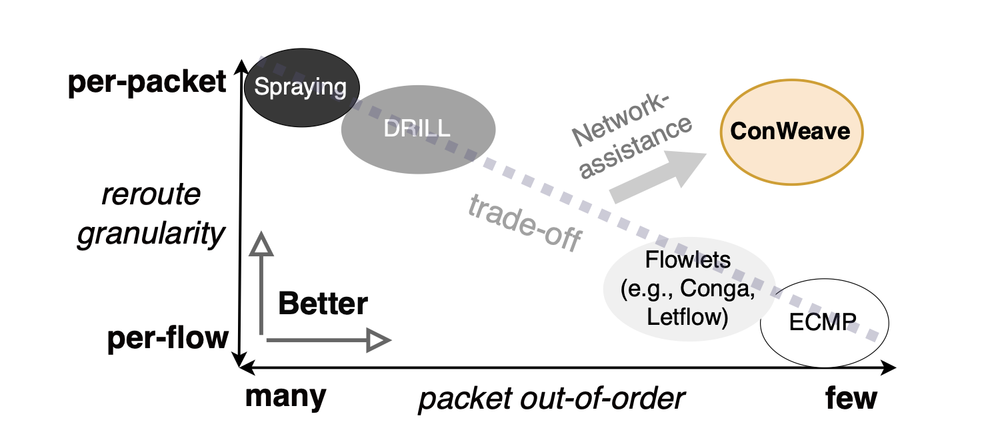
  <p><strong>Figure 1.</strong> Trade-off between rerouting granularity and packet reordering. ConWeave uses network assistance to support fine-grained rerouting without exposing out-of-order packets to the RDMA receiver. Source: Song et al., Figure 4.</p>
</center>


It has two cooperating components, both running on programmable top-of-rack (ToR) switches. It’s worth noting that no changes to RNICs, applications, or end hosts are required:

- **Source ToR:** continuously monitors round-trip latency for every active flow to detect when the current path is becoming congested. When it decides to reroute, it picks a new, currently-uncongested path, but only does so under three conditions: (1) the current path is congested, (2) a non-congested alternative path exists, and (3) any out-of-order packets from a previous reroute have already been resolved at the destination. This last condition is what keeps things predictable: it guarantees that a flow never has in-flight packets on more than two paths at once, which makes reordering inexpensive.
- **Destination ToR:** exploits queue pause/resume features available on the Intel Tofino2 programmable switch to buffer any packets that arrive out of order and release them in the correct sequence, entirely in the data plane, before they ever reach the receiving RNIC.

To make the reordering possible, the switch needs two basic elements: queues to temporarily hold and release packets, and stateful memory to keep track of the current reordering state.

However, ConWeave’s actual implementation does not reorder packets using their sequence numbers. Instead, it carefully controls each reroute and uses the `TAIL` and `REROUTED` flags to distinguish packets sent before and after the path change.

## 1.1 How does rerouting actually work?

ConWeave continuously monitors the current path using `RTT_REQUEST` and `RTT_REPLY` packets. If the reply does not arrive before the configured cutoff, the source ToR assumes that the path is congested and considers rerouting.

Before moving the flow, the source selects a path that is not marked as congested. Congested paths are identified through `NOTIFY` packets sent by the destination ToR and are avoided for a period of θ<sub>path_busy</sub>. If no suitable path is available, the reroute is cancelled because that means the network is heavily congested.

When rerouting happens, the last packet sent on the old path is marked as `TAIL`, while the following packets are sent on the new path with the `REROUTED` flag. The source then waits for a `CLEAR` message from the destination before starting a new epoch. This prevents multiple reroutes from overlapping and guarantees that a flow has packets in flight on at most two paths. The complete rerouting sequence is illustrated in Figure 2.

If the `CLEAR` message is lost, the source starts a new epoch after an inactivity period longer than θ<sub>inactive</sub>.

<center>
  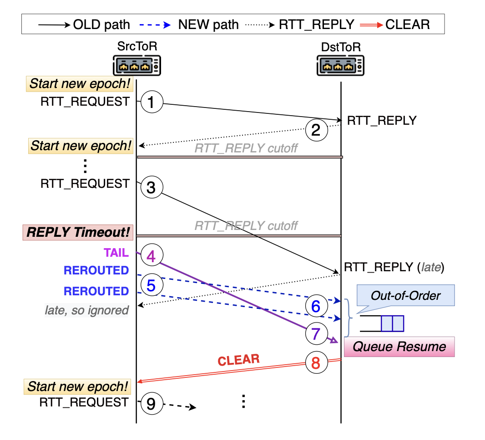
  <p><strong>Figure 2.</strong> ConWeave's rerouting procedure. After an RTT reply timeout, the source marks the final old-path packet as <code>TAIL</code>, sends later packets on the new path as <code>REROUTED</code>, and waits for <code>CLEAR</code> before beginning a new epoch. Source: Song et al., Figure 8.</p>
</center>

## 1.2 How is packet reordering handled?

If the `REROUTED` packets arrive after the `TAIL`, they can be forwarded normally. If they arrive before it, the destination ToR temporarily stores them in a paused reorder queue.

Once the `TAIL` arrives, it is forwarded first, the reorder queue is resumed, and the buffered packets are released in the correct order. The destination then sends `CLEAR` to the source.

If the `TAIL` packet is lost, the buffered packets could remain stuck indefinitely. To avoid this, ConWeave uses a timer T<sub>resume</sub>. When the timer expires, the reorder queue is resumed and flushed even if the `TAIL` has not arrived. Figure 3 illustrates how the destination ToR pauses and later releases packets that arrive before the `TAIL`.

<center>
  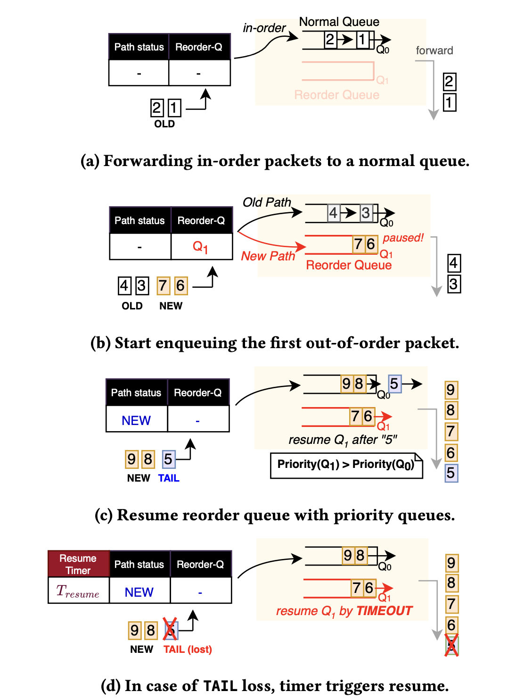
  <p><strong>Figure 3.</strong> Packet reordering at the destination ToR. Packets from the new path are paused when they arrive before the <code>TAIL</code> and are released after the old-path traffic has completed. Source: Song et al., Figure 9.</p>
</center>

### Main contributions of the paper

1. An RDMA-aware load-balancing design that can reroute traffic more frequently than flowlet-based schemes.
2. An in-network reordering mechanism implemented in the data plane of an Intel Tofino2 programmable switch.
3. An evaluation via both NS-3 simulation and a hardware Tofino2 testbed showing ConWeave improves average and 99th-percentile flow completion time by up to 42.3% and 66.8% respectively over the best existing schemes.

# 2. Selected Result

The result selected for reproduction is the comparison of ConWeave against existing load-balancing mechanisms in Figures 12 and 13 of the paper. More specifically, the reproduction focuses on the results at 50% average network load, shown in Figures 12(a–b) and 13(a–b). They directly test the paper’s central claim that ConWeave can reroute flows more frequently than ECMP or flowlet-based schemes without exposing the RNIC to packet reordering.

These figures report the average and 99th-percentile flow completion time slowdown for the AliCloud Storage workload under two RDMA configurations:

- Lossless RDMA, using Priority Flow Control and Go-Back-N loss recovery;
- IRN RDMA, using Selective Repeat and end-to-end flow control that limits the amount of in-flight data to one bandwidth-delay product.

The reproduced comparison includes ECMP, LetFlow, CONGA, and ConWeave. ECMP selects one path per flow, LetFlow and CONGA reroute at flowlet boundaries, and ConWeave supports finer-grained congestion-driven rerouting using in-network reordering. DRILL is excluded because it is not launched by the artifact’s supplied `autorun.sh` script.


## 2.1 Reference results from the paper

Figures 4 and 5 show the original 50% load results used as the reference for this reproduction. Figure 4 reports the Lossless RDMA configuration, while Figure 5 reports the IRN configuration.

<center>
  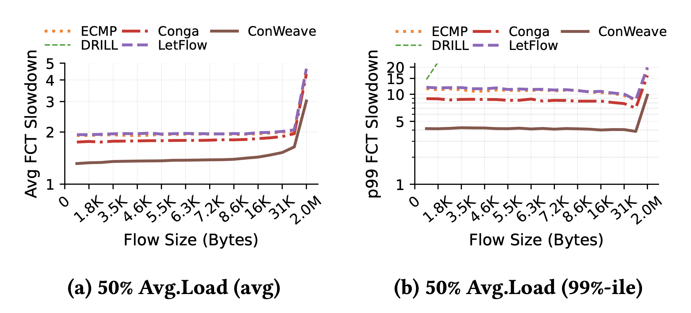
  <p><strong>Figure 4.</strong> Original average and 99th-percentile FCT slowdown for the AliCloud Storage workload at 50% load under Lossless RDMA. Source: Song et al., Figure 12(a-b).</p>
</center>

<center>
  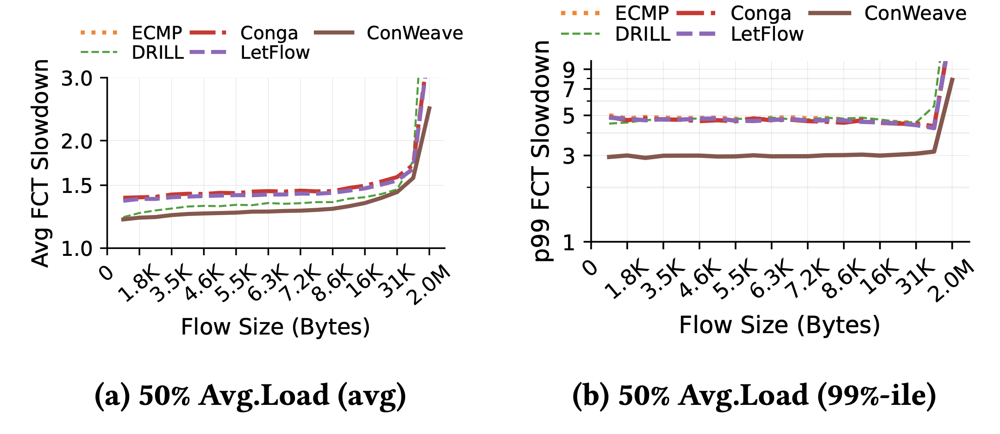
  <p><strong>Figure 5.</strong> Original average and 99th-percentile FCT slowdown for the AliCloud Storage workload at 50% load under IRN RDMA. Source: Song et al., Figure 13(a-b).</p>
</center>

At 50% average network load, the paper reports the following minimum improvements over the competing schemes:

<table style="width:100%; border-collapse:collapse; margin:0.8em 0 1em; border-top:2px solid #000; border-bottom:2px solid #000; page-break-inside:avoid;">
  <thead>
    <tr>
      <th style="padding:0.4em 0.55em; text-align:left; border-bottom:1px solid #000;">RDMA configuration</th>
      <th style="padding:0.4em 0.55em; text-align:right; border-bottom:1px solid #000;">Average FCT improvement</th>
      <th style="padding:0.4em 0.55em; text-align:right; border-bottom:1px solid #000;">p99 FCT improvement</th>
    </tr>
  </thead>
  <tbody>
    <tr>
      <td style="padding:0.35em 0.55em; border-bottom:1px solid #d0d0d0;">Lossless RDMA</td>
      <td style="padding:0.35em 0.55em; text-align:right; border-bottom:1px solid #d0d0d0;">23.3%</td>
      <td style="padding:0.35em 0.55em; text-align:right; border-bottom:1px solid #d0d0d0;">45.8%</td>
    </tr>
    <tr>
      <td style="padding:0.35em 0.55em;">IRN RDMA</td>
      <td style="padding:0.35em 0.55em; text-align:right;">12.7%</td>
      <td style="padding:0.35em 0.55em; text-align:right;">46.2%</td>
    </tr>
  </tbody>
</table>

These values are the results reported by the paper’s authors. They are used as reference points for the reproduction.

A successful reproduction does not need to produce exactly the same numerical values because traffic generation, flow placement, and path selection contain randomized components. The main objective is instead to reproduce the same qualitative behaviour:

1. ConWeave should have the lowest, or close to the lowest, average FCT slowdown.
2. Its advantage should generally be larger for the 99th percentile than for the average.
3. The advantage should appear under both Lossless and IRN RDMA.
4. ECMP, LetFlow, and CONGA should show similar or higher slowdown than ConWeave.

# 3. Environment Setup

## 3.1 Paper artifact

The experiments were based on upstream commit `236a801a00e35de9078635e04acae2f701c21ded`. The artifact is based on NS-3.19 and includes the network topology, traffic generator, load-balancing implementations, execution scripts, and FCT post-processing tools needed for the simulations.

For the reproduction, no changes were made to the simulator or to the implementations of the load-balancing algorithms. The only modification was made to a copy of `autorun.sh`: a final `wait` command was added because the original script starts every simulation in the background and exits immediately. Adding `wait` made it possible to track when all eight simulations had actually finished.

The further exploration reused the same simulator and did not change ECMP, LetFlow, ConWeave, the RDMA transport, or the switch implementation. It added a deterministic static-trace generator, an external validator/analyzer, an isolated runner, and optional `run.py` arguments for selecting a trace, assigning a run ID, separating the extension history, and skipping the original FCT analyzer. These extension-specific changes are described in Section 5.4.

## 3.2 Host system

The simulations were executed on a personal desktop with the following configuration:

<table style="width:100%; border-collapse:collapse; margin:0.8em 0 1em; border-top:2px solid #000; border-bottom:2px solid #000; page-break-inside:avoid;">
  <thead>
    <tr>
      <th style="width:42%; padding:0.4em 0.55em; text-align:left; border-bottom:1px solid #000;">Component</th>
      <th style="padding:0.4em 0.55em; text-align:left; border-bottom:1px solid #000;">Configuration</th>
    </tr>
  </thead>
  <tbody>
    <tr><td style="padding:0.32em 0.55em; border-bottom:1px solid #d0d0d0;">Host operating system</td><td style="padding:0.32em 0.55em; border-bottom:1px solid #d0d0d0;">EndeavourOS</td></tr>
    <tr><td style="padding:0.32em 0.55em; border-bottom:1px solid #d0d0d0;">Kernel</td><td style="padding:0.32em 0.55em; border-bottom:1px solid #d0d0d0;">Linux 7.0.9-arch1-1</td></tr>
    <tr><td style="padding:0.32em 0.55em; border-bottom:1px solid #d0d0d0;">Architecture</td><td style="padding:0.32em 0.55em; border-bottom:1px solid #d0d0d0;">x86-64</td></tr>
    <tr><td style="padding:0.32em 0.55em; border-bottom:1px solid #d0d0d0;">CPU</td><td style="padding:0.32em 0.55em; border-bottom:1px solid #d0d0d0;">i5-9600K (6 cores, 4.60 GHz)</td></tr>
    <tr><td style="padding:0.32em 0.55em; border-bottom:1px solid #d0d0d0;">System memory</td><td style="padding:0.32em 0.55em; border-bottom:1px solid #d0d0d0;">31.27 GiB</td></tr>
    <tr><td style="padding:0.32em 0.55em; border-bottom:1px solid #d0d0d0;">Docker Engine</td><td style="padding:0.32em 0.55em; border-bottom:1px solid #d0d0d0;">29.6.1</td></tr>
    <tr><td style="padding:0.32em 0.55em; border-bottom:1px solid #d0d0d0;">Docker storage driver</td><td style="padding:0.32em 0.55em; border-bottom:1px solid #d0d0d0;">overlayfs</td></tr>
    <tr><td style="padding:0.32em 0.55em;">Cgroup version</td><td style="padding:0.32em 0.55em;">2</td></tr>
  </tbody>
</table>

## 3.3 Docker environment

The host uses Python 3.14. Running the repository directly on the host was not possible because NS-3.19 and its version of Waf depend on older Python behaviour.

For example, the ConWeave driver contains:

```python
random.seed(datetime.now())
```

Python 3.14 does not accept a `datetime` object as a random seed and raises an error.

Other utilities in the NS-3.19 directory also contain legacy Python syntax. Instead of modifying several parts of the artifact, a Docker container was used to provide a compatible software environment.

The Docker image was named `cw-sim:sigcomm23ae`.

The host project directory was bind-mounted inside the container as `/root`. The container was launched using:

```bash
docker run -dit \
  --name cw-sim \
  --mount type=bind,src=/home/malak/Projects/ns-allinone-3.19,dst=/root \
  --workdir /root/ns-3.19 \
  cw-sim:sigcomm23ae
```

## 3.4 Network topology

The experiment uses the default topology supplied by the repository, `leaf_spine_128_100G_OS2`.

It is a two-tier leaf-spine topology with a 2:1 oversubscription ratio.

<table style="width:100%; border-collapse:collapse; margin:0.8em 0 1em; border-top:2px solid #000; border-bottom:2px solid #000; page-break-inside:avoid;">
  <thead>
    <tr>
      <th style="padding:0.4em 0.55em; text-align:left; border-bottom:1px solid #000;">Parameter</th>
      <th style="padding:0.4em 0.55em; text-align:right; border-bottom:1px solid #000;">Value</th>
    </tr>
  </thead>
  <tbody>
    <tr><td style="padding:0.32em 0.55em; border-bottom:1px solid #d0d0d0;">Leaf switches</td><td style="padding:0.32em 0.55em; text-align:right; border-bottom:1px solid #d0d0d0;">8</td></tr>
    <tr><td style="padding:0.32em 0.55em; border-bottom:1px solid #d0d0d0;">Spine switches</td><td style="padding:0.32em 0.55em; text-align:right; border-bottom:1px solid #d0d0d0;">8</td></tr>
    <tr><td style="padding:0.32em 0.55em; border-bottom:1px solid #d0d0d0;">Servers</td><td style="padding:0.32em 0.55em; text-align:right; border-bottom:1px solid #d0d0d0;">128</td></tr>
    <tr><td style="padding:0.32em 0.55em; border-bottom:1px solid #d0d0d0;">Servers per rack</td><td style="padding:0.32em 0.55em; text-align:right; border-bottom:1px solid #d0d0d0;">16</td></tr>
    <tr><td style="padding:0.32em 0.55em; border-bottom:1px solid #d0d0d0;">Link capacity</td><td style="padding:0.32em 0.55em; text-align:right; border-bottom:1px solid #d0d0d0;">100 Gbit/s</td></tr>
    <tr><td style="padding:0.32em 0.55em; border-bottom:1px solid #d0d0d0;">Link propagation delay</td><td style="padding:0.32em 0.55em; text-align:right; border-bottom:1px solid #d0d0d0;">1 μs</td></tr>
    <tr><td style="padding:0.32em 0.55em; border-bottom:1px solid #d0d0d0;">Switch buffer capacity</td><td style="padding:0.32em 0.55em; text-align:right; border-bottom:1px solid #d0d0d0;">9 MB</td></tr>
    <tr><td style="padding:0.32em 0.55em;">Oversubscription</td><td style="padding:0.32em 0.55em; text-align:right;">2:1</td></tr>
  </tbody>
</table>

The original evaluation uses shared switch buffers, allowing the available buffer space to be allocated dynamically between ports depending on current traffic conditions.

## 3.5 Workload

The reproduced experiment uses the AliCloud Storage flow-size distribution.

For every generated flow, the simulator randomly selects a source server and a destination server and then samples a flow size from the workload distribution. Flow arrivals follow a Poisson process, meaning that different flows begin independently rather than as part of a synchronized communication phase.

The paper evaluates two average load levels:

- 50%, representing a moderately loaded network;
- 80%, representing a highly loaded network.

Only the 50% load case is reproduced in this project because the complete simulation set requires a significant amount of execution time on the available personal desktop and it took approximately 12 hours to complete.

The repository script uses the traffic-generation interval `--simul_time 0.1`.

The full reproduction of the 50% load level requires eight simulations (4 load-balancing algorithms × 2 RDMA modes).

## 3.6 Transport and flow-control configurations

The simulations use DCQCN as the congestion-control mechanism. Two different RDMA configurations are evaluated.

### Lossless RDMA

The Lossless RDMA configuration uses:

- `pfc = 1`;
- `irn = 0`.

This enables Priority Flow Control and Go-Back-N loss recovery.

When congestion becomes severe, PFC may pause upstream links to prevent packet loss. Go-Back-N can also retransmit several packets when a packet loss or apparent packet gap is detected.

### IRN RDMA

The IRN configuration uses:

- `pfc = 0`;
- `irn = 1`.

This enables:

- Selective Repeat loss recovery;
- end-to-end flow control;
- a limit of one bandwidth-delay product of in-flight data.

Selective Repeat retransmits only the packets that are considered missing, rather than retransmitting all following packets. The one-BDP limit also bounds the amount of outstanding traffic.

The paper evaluates both configurations because ConWeave is intended to work with current lossless RDMA networks as well as with the more loss-tolerant IRN design.

## 3.7 ConWeave parameters

For the two-tier leaf-spine topology, the paper reports the following parameters:

<table style="width:100%; border-collapse:collapse; margin:0.8em 0 1em; border-top:2px solid #000; border-bottom:2px solid #000; page-break-inside:avoid;">
  <thead>
    <tr>
      <th style="width:20%; padding:0.4em 0.55em; text-align:left; border-bottom:1px solid #000;">Parameter</th>
      <th style="padding:0.4em 0.55em; text-align:left; border-bottom:1px solid #000;">Meaning</th>
      <th style="width:15%; padding:0.4em 0.55em; text-align:right; border-bottom:1px solid #000;">Value</th>
    </tr>
  </thead>
  <tbody>
    <tr><td style="padding:0.35em 0.55em; border-bottom:1px solid #d0d0d0;">θ<sub>reply</sub></td><td style="padding:0.35em 0.55em; border-bottom:1px solid #d0d0d0;">RTT-reply timeout used to detect congestion</td><td style="padding:0.35em 0.55em; text-align:right; border-bottom:1px solid #d0d0d0; white-space:nowrap;">8 μs</td></tr>
    <tr><td style="padding:0.35em 0.55em; border-bottom:1px solid #d0d0d0;">θ<sub>path_busy</sub></td><td style="padding:0.35em 0.55em; border-bottom:1px solid #d0d0d0;">Time for which a congested path is avoided</td><td style="padding:0.35em 0.55em; text-align:right; border-bottom:1px solid #d0d0d0; white-space:nowrap;">8 μs</td></tr>
    <tr><td style="padding:0.35em 0.55em;">θ<sub>inactive</sub></td><td style="padding:0.35em 0.55em;">Inactivity period used to start a new epoch</td><td style="padding:0.35em 0.55em; text-align:right; white-space:nowrap;">300 μs</td></tr>
  </tbody>
</table>

The reply cutoff determines how quickly ConWeave reacts to an increase in path delay. A smaller value allows faster and more fine-grained rerouting, but it may also cause more packets to arrive out of order and therefore increase the reordering overhead.

The path-busy period prevents ConWeave from immediately choosing a path that was recently marked as congested. The inactivity timeout allows the source to begin a new epoch if the expected `CLEAR` message is lost.

The supplied artifact represents the 8 μs reply deadline as a 4 μs inter-rack base RTT plus `CONWEAVE_REPLY_TIMEOUT_EXTRA = 4 μs`. Its default `run.py` configuration also uses `CONWEAVE_PATH_PAUSE_TIME = 16 μs` and `CONWEAVE_TX_EXPIRY_TIME = 300 μs`. The artifact does not explicitly document whether `CONWEAVE_PATH_PAUSE_TIME` maps directly to θ<sub>path_busy</sub>, so the paper-reported and implementation-level values are distinguished here rather than treated as identical.

## 3.8 Building NS-3

The repository was placed inside the NS-3.19 directory and built inside the Docker container using the optimized build profile:

```bash
cd /root/ns-3.19
./waf configure --build-profile=optimized
./waf -j6
```

The resulting simulation executable was `build/scratch/network-load-balance`.

Before launching the full experiment set, a short ECMP smoke test was performed to verify that:

- the simulator started correctly;
- traffic files were generated;
- the NS-3 executable completed;
- raw FCT output was produced;
- post-processing generated a non-empty FCT summary.

## 3.9 Issues encountered during setup

The main setup issue was incompatibility between NS-3.19’s legacy Python tooling and Python 3.14 on the host. This was resolved by using the provided Docker-compatible environment rather than modifying the simulator.

A second problem was that Docker commands failed with a permission error even though the daemon was running, because the current user was not yet a member of the docker group. `usermod -aG docker` solved this, but only after a full logout/login cycle.

The final issue was that the original `autorun.sh` script did not wait for the simulations it launched. A copy of the script was therefore created with a final `wait` command. This did not change the experiment itself but only made it possible to detect when every background simulation had completed.

## 3.10 Deviations from the original evaluation

The reproduction differs from the paper in the following ways:

1. Only the 50% load case is reproduced, while the paper also evaluates 80% load.
2. DRILL is not included because the supplied automation launches only ECMP, LetFlow, CONGA, and ConWeave.
3. The simulations run on a personal six-core desktop rather than on the original authors’ simulation hardware, which is not specified in the paper.
4. A Docker container is used because the old NS-3.19 environment is not compatible with the host Python installation.
5. One simulation is executed for each algorithm and RDMA configuration. No independent repeated runs are performed.
6. The paper reports θ<sub>path_busy</sub> = 8 μs, while the supplied artifact uses the implementation-level parameter `CONWEAVE_PATH_PAUSE_TIME = 16 μs`. The artifact does not explicitly document whether these quantities are directly equivalent.

These differences should be considered when comparing the reproduced results with the original paper.

# 4. Experimental Results

## 4.1 Execution procedure

The reproduction was launched using the modified copy of `autorun.sh`.

The experiment configuration was:

```text
Topology:        leaf_spine_128_100G_OS2
Average load:    50%
Simulation time: 0.1 s
Algorithms:      ECMP, LetFlow, CONGA, ConWeave
RDMA modes:      Lossless and IRN
```

The script starts the four load-balancing mechanisms under both RDMA configurations, resulting in eight independent NS-3 processes.

The simulations were run concurrently. On the six-core host, the Docker container used approximately 520–530% CPU and around 7.5 GiB of memory. Since eight simulations were sharing six physical cores, each process received approximately 65% of one CPU core on average.

## 4.2 Measurement method

The main metric is flow completion time slowdown, defined as:

<p align="center"><strong>FCT slowdown</strong> = FCT measured under network load / base FCT without competing traffic</p>

A value of 1 therefore represents unloaded performance. Results are grouped by flow size and reported using mean and 99th-percentile slowdown, capturing typical and tail performance respectively.

The aggregate values reported below use the same measurement window as the generated repository plots: flows with a start time later than 2.005 s and with `start + FCT` earlier than 2.150 s. This selects 929,375 flows from each simulation, while the figures retain the paper-style flow-size grouping and axes.

## 4.3 Number of runs and statistical treatment

One simulation was launched for each combination of load balancer and RDMA mode. This produces eight runs in total.

The average and p99 values are calculated across the flows generated within each simulation. They are not averages across several repeated simulations with different random seeds.

For this reason, the reproduced figures do not include confidence intervals or error bars across repeated runs. Every official run used the artifact's fixed random seed and produced 978,094 completed-flow records; 929,375 records per run fall inside the analysis window used for the aggregate values.

## 4.4 Correctness checks

Correctness was first checked through the short ECMP smoke test. The smoke simulation completed all 98,011 generated flows, produced non-empty raw and summarized FCT output, and contained no fatal-error signature.

The eight official runs were then audited against their intended configurations. For every run:

- the launcher and simulator completed successfully;
- the history entry and `config.txt` agreed on topology, load-balancing mode, network load, `pfc`, and `irn`;
- the simulator completed all expected flows and produced 978,094 raw FCT rows;
- the FCT summary existed and was non-empty;
- the log contained no assertion failure, segmentation fault, fatal error, abort, core dump, or traceback;
- the expected average, p99, uplink, and queue plots were generated successfully.

All eight runs passed these checks without retry. That mattered here specifically because `autorun.sh` backgrounds all eight processes and returns immediately, so a run that silently died at t=0.02s and one that finished cleanly are indistinguishable from the shell prompt alone.

## 4.5 Reproduced results

All eight 50% load simulations completed successfully. The aggregate slowdown values measured inside the common analysis window are:

<table style="width:100%; border-collapse:collapse; margin:0.8em 0 1em; border-top:2px solid #000; border-bottom:2px solid #000; page-break-inside:avoid; font-size:0.9em;">
  <thead>
    <tr>
      <th style="width:25%; padding:0.4em 0.5em; text-align:left; border-bottom:1px solid #000;">RDMA configuration</th>
      <th style="width:22%; padding:0.4em 0.5em; text-align:left; border-bottom:1px solid #000;">Algorithm</th>
      <th style="padding:0.4em 0.5em; text-align:right; border-bottom:1px solid #000;">Average FCT slowdown</th>
      <th style="padding:0.4em 0.5em; text-align:right; border-bottom:1px solid #000;">p99 FCT slowdown</th>
    </tr>
  </thead>
  <tbody>
    <tr><td style="padding:0.32em 0.5em; border-bottom:1px solid #d0d0d0;">Lossless</td><td style="padding:0.32em 0.5em; border-bottom:1px solid #d0d0d0;">ECMP</td><td style="padding:0.32em 0.5em; text-align:right; border-bottom:1px solid #d0d0d0;">1.9104</td><td style="padding:0.32em 0.5em; text-align:right; border-bottom:1px solid #d0d0d0;">10.4049</td></tr>
    <tr><td style="padding:0.32em 0.5em; border-bottom:1px solid #d0d0d0;">Lossless</td><td style="padding:0.32em 0.5em; border-bottom:1px solid #d0d0d0;">LetFlow</td><td style="padding:0.32em 0.5em; text-align:right; border-bottom:1px solid #d0d0d0;">1.8991</td><td style="padding:0.32em 0.5em; text-align:right; border-bottom:1px solid #d0d0d0;">10.2532</td></tr>
    <tr><td style="padding:0.32em 0.5em; border-bottom:1px solid #d0d0d0;">Lossless</td><td style="padding:0.32em 0.5em; border-bottom:1px solid #d0d0d0;">CONGA</td><td style="padding:0.32em 0.5em; text-align:right; border-bottom:1px solid #d0d0d0;">1.6724</td><td style="padding:0.32em 0.5em; text-align:right; border-bottom:1px solid #d0d0d0;">7.9603</td></tr>
    <tr><td style="padding:0.32em 0.5em; border-bottom:1px solid #d0d0d0;">Lossless</td><td style="padding:0.32em 0.5em; border-bottom:1px solid #d0d0d0;"><strong>ConWeave</strong></td><td style="padding:0.32em 0.5em; text-align:right; border-bottom:1px solid #d0d0d0;"><strong>1.4654</strong></td><td style="padding:0.32em 0.5em; text-align:right; border-bottom:1px solid #d0d0d0;"><strong>5.3249</strong></td></tr>
    <tr><td style="padding:0.32em 0.5em; border-bottom:1px solid #d0d0d0;">IRN</td><td style="padding:0.32em 0.5em; border-bottom:1px solid #d0d0d0;">ECMP</td><td style="padding:0.32em 0.5em; text-align:right; border-bottom:1px solid #d0d0d0;">1.5447</td><td style="padding:0.32em 0.5em; text-align:right; border-bottom:1px solid #d0d0d0;">6.5007</td></tr>
    <tr><td style="padding:0.32em 0.5em; border-bottom:1px solid #d0d0d0;">IRN</td><td style="padding:0.32em 0.5em; border-bottom:1px solid #d0d0d0;">LetFlow</td><td style="padding:0.32em 0.5em; text-align:right; border-bottom:1px solid #d0d0d0;">1.5527</td><td style="padding:0.32em 0.5em; text-align:right; border-bottom:1px solid #d0d0d0;">6.5957</td></tr>
    <tr><td style="padding:0.32em 0.5em; border-bottom:1px solid #d0d0d0;">IRN</td><td style="padding:0.32em 0.5em; border-bottom:1px solid #d0d0d0;">CONGA</td><td style="padding:0.32em 0.5em; text-align:right; border-bottom:1px solid #d0d0d0;">1.4903</td><td style="padding:0.32em 0.5em; text-align:right; border-bottom:1px solid #d0d0d0;">5.9067</td></tr>
    <tr><td style="padding:0.32em 0.5em;">IRN</td><td style="padding:0.32em 0.5em;"><strong>ConWeave</strong></td><td style="padding:0.32em 0.5em; text-align:right;"><strong>1.3490</strong></td><td style="padding:0.32em 0.5em; text-align:right;"><strong>3.8011</strong></td></tr>
  </tbody>
</table>


Figures 6 and 7 present the reproduced flow-size-grouped results under Lossless and IRN RDMA, respectively.

<center>
  <div style="display:inline-block; width:46%; vertical-align:top;">
    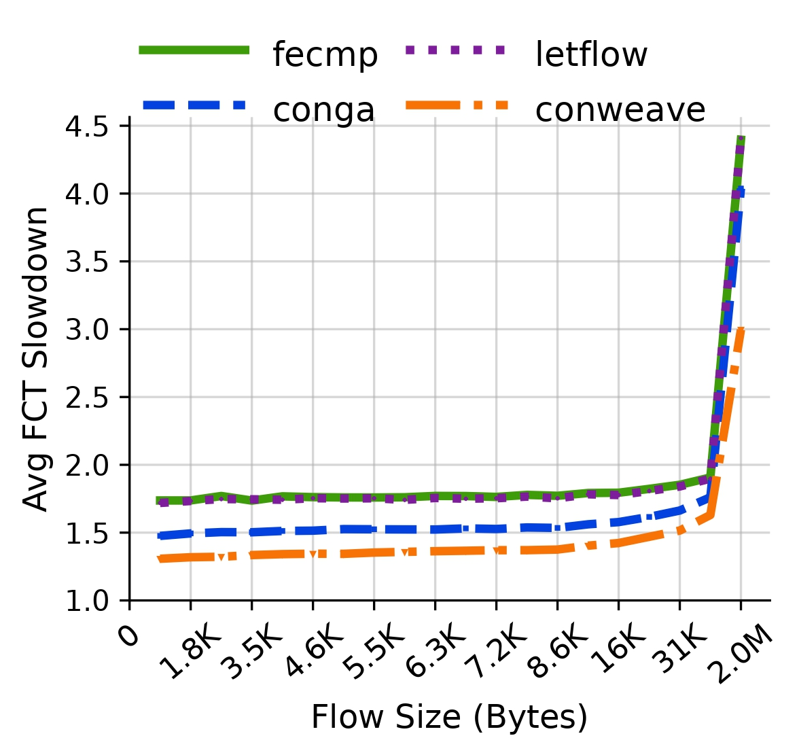
  </div>

  <div style="display:inline-block; width:46%; vertical-align:top; padding-left:1em;">
    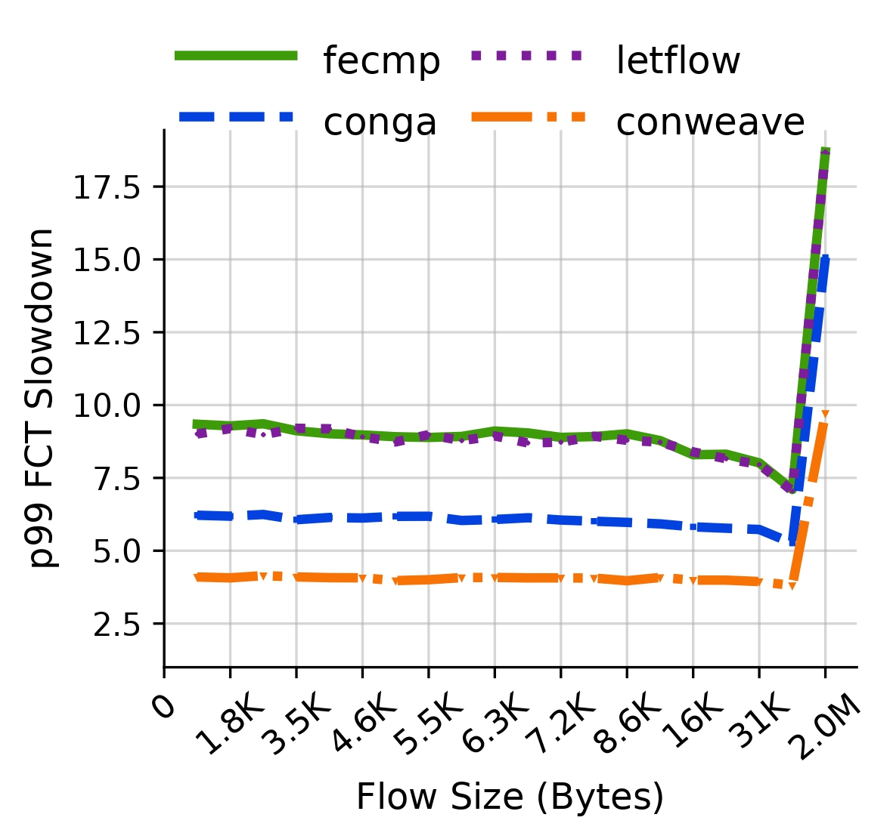
  </div>

  <p><strong>Figure 6.</strong> Reproduced average (left) and 99th-percentile (right) FCT slowdown for the AliCloud Storage workload at 50% load under Lossless RDMA.</p>
</center>

<center style="page-break-inside:avoid; break-inside:avoid;">
  <div style="display:inline-block; width:46%; vertical-align:top;">
    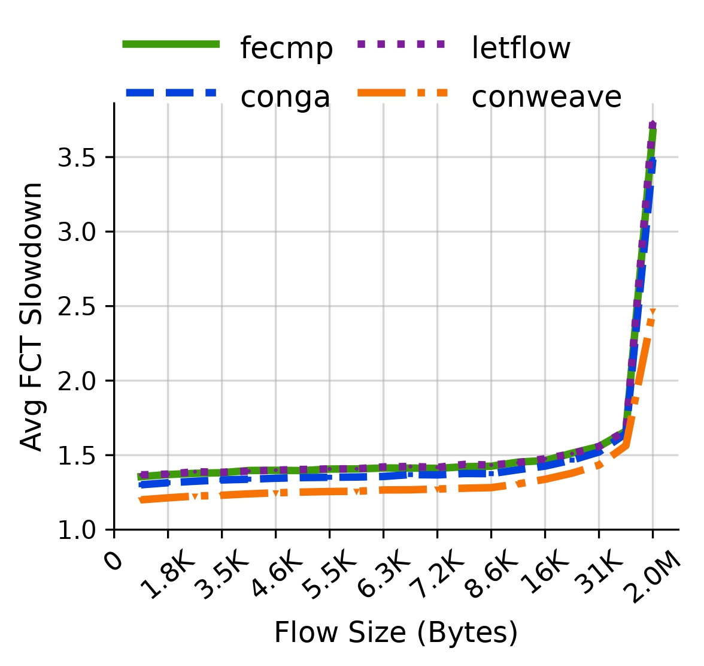
  </div>

  <div style="display:inline-block; width:46%; vertical-align:top; padding-left:1em;">
    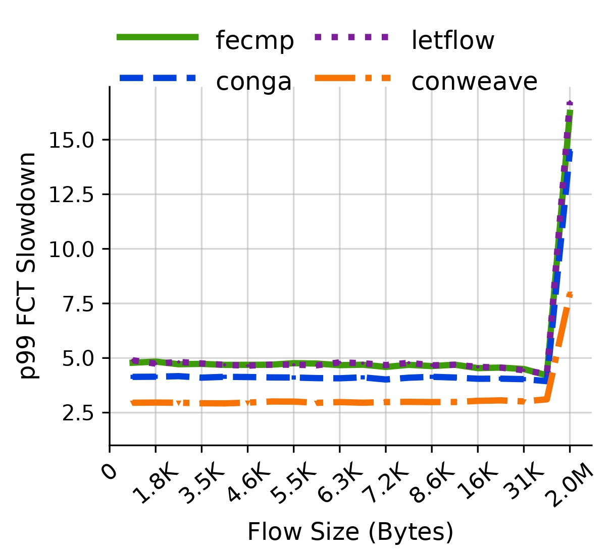
  </div>

  <p><strong>Figure 7.</strong> Reproduced average (left) and 99th-percentile (right) FCT slowdown for the AliCloud Storage workload at 50% load under IRN RDMA.</p>
</center>

The qualitative result matches the paper. ConWeave has lower aggregate average and p99 slowdown than ECMP, LetFlow, and CONGA in both RDMA configurations: ConWeave has lower slowdown in all six pairwise baseline comparisons for both the average and p99 metrics. The plotted ConWeave curve also remains below the other available schemes across the flow-size groups in Figures 6 and 7.

Relative to the strongest reproduced baseline, CONGA, ConWeave reduces average slowdown by 12.38% and p99 slowdown by 33.11% under Lossless RDMA. Under IRN, the corresponding reductions are 9.48% and 35.65%.

The following table directly compares these reproduced reductions against the minimum improvements reported in the paper.

<table style="width:100%; border-collapse:collapse; margin:0.8em 0 0.4em; border-top:2px solid #000; border-bottom:2px solid #000; page-break-inside:avoid; font-size:0.84em;">
  <thead>
    <tr>
      <th style="padding:0.4em 0.45em; text-align:left; border-bottom:1px solid #000;">RDMA mode</th>
      <th style="padding:0.4em 0.45em; text-align:left; border-bottom:1px solid #000;">Metric</th>
      <th style="padding:0.4em 0.45em; text-align:right; border-bottom:1px solid #000;">Paper-reported improvement</th>
      <th style="padding:0.4em 0.45em; text-align:right; border-bottom:1px solid #000;">Reproduced improvement</th>
      <th style="padding:0.4em 0.45em; text-align:right; border-bottom:1px solid #000;">Difference</th>
    </tr>
  </thead>
  <tbody>
    <tr>
      <td style="padding:0.34em 0.45em; border-bottom:1px solid #d0d0d0;">Lossless</td>
      <td style="padding:0.34em 0.45em; border-bottom:1px solid #d0d0d0;">Average</td>
      <td style="padding:0.34em 0.45em; text-align:right; border-bottom:1px solid #d0d0d0;">23.30%</td>
      <td style="padding:0.34em 0.45em; text-align:right; border-bottom:1px solid #d0d0d0;">12.38%</td>
      <td style="padding:0.34em 0.45em; text-align:right; border-bottom:1px solid #d0d0d0;">−10.92 pp</td>
    </tr>
    <tr>
      <td style="padding:0.34em 0.45em; border-bottom:1px solid #d0d0d0;">Lossless</td>
      <td style="padding:0.34em 0.45em; border-bottom:1px solid #d0d0d0;">p99</td>
      <td style="padding:0.34em 0.45em; text-align:right; border-bottom:1px solid #d0d0d0;">45.80%</td>
      <td style="padding:0.34em 0.45em; text-align:right; border-bottom:1px solid #d0d0d0;">33.11%</td>
      <td style="padding:0.34em 0.45em; text-align:right; border-bottom:1px solid #d0d0d0;">−12.69 pp</td>
    </tr>
    <tr>
      <td style="padding:0.34em 0.45em; border-bottom:1px solid #d0d0d0;">IRN</td>
      <td style="padding:0.34em 0.45em; border-bottom:1px solid #d0d0d0;">Average</td>
      <td style="padding:0.34em 0.45em; text-align:right; border-bottom:1px solid #d0d0d0;">12.70%</td>
      <td style="padding:0.34em 0.45em; text-align:right; border-bottom:1px solid #d0d0d0;">9.48%</td>
      <td style="padding:0.34em 0.45em; text-align:right; border-bottom:1px solid #d0d0d0;">−3.22 pp</td>
    </tr>
    <tr>
      <td style="padding:0.34em 0.45em;">IRN</td>
      <td style="padding:0.34em 0.45em;">p99</td>
      <td style="padding:0.34em 0.45em; text-align:right;">46.20%</td>
      <td style="padding:0.34em 0.45em; text-align:right;">35.65%</td>
      <td style="padding:0.34em 0.45em; text-align:right;">−10.55 pp</td>
    </tr>
  </tbody>
</table>

<p style="font-size:0.88em; margin-top:0.25em;"><em>The difference is the reproduced improvement minus the paper-reported improvement and is expressed in percentage points (pp).</em></p>

The direct comparison shows that the reproduced improvements are smaller than the minimum improvements reported in the paper. The closest numerical agreement is obtained for average FCT under IRN, where the reproduced reduction is 3.22 percentage points lower. Nevertheless, the same qualitative behaviour is preserved: ConWeave outperforms the strongest reproduced baseline under both RDMA configurations, and its benefit is substantially larger for p99 FCT than for average FCT. The conclusion is limited to the 50% load case, the supplied trace and fixed seed, and one run per configuration.

# 5. Further Exploration

## 5.1 Motivation

The further exploration studies how ConWeave behaves under synchronized RDMA communication patterns representative of HPC applications.

The original evaluation mainly uses data-center workloads where flow sizes are sampled from measured distributions and flows arrive independently according to a Poisson process. This is appropriate for asynchronous storage and RPC-style traffic, but it does not fully represent the communication behaviour of many HPC applications.

HPC applications often execute collective operations in which many processes begin communicating at approximately the same time. Instead of independent traffic arriving gradually, the network receives a coordinated burst of flows. This can create sudden hotspots, correlated congestion, and strong competition between flows.

The purpose of this extension is therefore to test whether ConWeave’s congestion-aware rerouting and in-network reordering remain useful when the traffic is structured and synchronized rather than generated through independent Poisson arrivals.

## 5.2 Research Questions

The extension addresses the following main research question:

> **Under synchronized RDMA collective-like traffic, when does ConWeave improve communication-phase completion time relative to ECMP and LetFlow, and how is that benefit affected by congestion structure, participant scale, and congestion-detection responsiveness?**

This main question is divided into three connected subquestions:

1. **Effect of communication pattern:**  
   How does ConWeave behave under synchronized all-to-all, slightly skewed all-to-all, and synchronized incast traffic, which create different congestion structures?

2. **Effect of communication intensity and participant scale:**  
   If ConWeave provides no benefit in a small synchronized all-to-all workload, is this because the communication phase is too short, or because too few hosts are active per rack to create fabric congestion?

3. **Effect of congestion-detection responsiveness:**  
   Once a full-scale synchronized all-to-all workload activates ConWeave, how does changing its RTT-reply timeout affect collective completion time and rerouting/reordering activity?

These questions are sequential. The initial workload comparison identifies when ConWeave is active and beneficial. The message-size and participant-scale experiments then distinguish communication duration from instantaneous fabric load. Finally, the timeout-sensitivity experiment examines whether ConWeave reacts quickly enough once the workload creates substantial congestion.

## 5.3 Selected Communication Patterns

Two communication patterns are considered:

1. All-to-all communication.
2. Incast communication.

These patterns were selected because they generate fundamentally different congestion structures.

### 5.3.1 All-to-all communication

In the all-to-all experiment, every participating host sends data to every other participant.

For P participants, the number of directed flows is:

<p align="center">N<sub>flows</sub> = P(P − 1)</p>


Two participant scales are considered. With 16 participants, the workload contains 16 × 15 = 240 directed flows. With all 128 hosts, it contains 128 × 127 = 16,256 directed flows.

The 16-host configuration activates only two servers per rack and is therefore a lightly loaded fabric experiment. The 128-host configuration activates all 16 servers in every rack and directly exercises the topology’s 2:1 oversubscription.

All-to-all communication creates traffic between many source–destination pairs simultaneously. Its performance can therefore be affected by:

- ECMP hash collisions;
- uneven uplink utilization;
- transient congestion on spine links;
- limited availability of flowlet boundaries;
- simultaneous competition among several long-running RDMA flows.

This pattern provides ConWeave with an opportunity to improve performance by detecting congested paths and dynamically redirecting traffic toward less loaded alternatives.

### 5.3.2 Incast communication

In the incast experiment, multiple senders transmit data simultaneously to a single receiver.

The selected configuration contains 15 senders and one receiver. The senders are distributed across the network so that the generated traffic traverses multiple leaf and spine switches before converging at the destination rack.

Unlike all-to-all communication, incast contains an unavoidable bottleneck. Although several paths may exist between the source racks and the destination rack, every flow must eventually traverse the same receiver-facing link.

Consequently, load balancing cannot remove the final destination bottleneck. Incast therefore acts as a control case for evaluating whether ConWeave’s benefits are primarily associated with avoidable path imbalance rather than with congestion in general.

## 5.4 Methodology and results

### 5.4.1 Implementation and experimental configuration

The extension uses the existing simulator path for reading a static flow trace. No load-balancing or RDMA implementation was modified. The added tooling generates deterministic HPC-style traces, launches each algorithm with isolated run IDs and histories, and validates the raw simulator output against the complete input trace before calculating the metrics.

All extension runs use the `leaf_spine_128_100G_OS2` topology, Lossless RDMA (`pfc = 1`, `irn = 0`), and deterministic traffic traces. Each workload–algorithm configuration was executed once.

The experiments were conducted in four stages:

1. ECMP, LetFlow, and ConWeave were compared under 16-host synchronized all-to-all, 50 μs-skewed all-to-all, and synchronized incast traffic.
2. Because the initial synchronized all-to-all workload did not activate ConWeave, its message size was increased from 1 MiB to 4 MiB while keeping the same 16 participants and placement.
3. Because increasing message size still produced no PFC, CNP, rerouting, or reordering activity, the synchronized 4 MiB workload was scaled to all 128 hosts.
4. Because the full-scale workload activated ConWeave, two additional runs tested half and double the default extra RTT-reply timeout.

Across these stages, 17 official extension runs were accepted: nine initial communication-pattern runs, three 16-host 4 MiB runs, and five full-scale runs. Smoke tests are not included in this count.

This staged design connects the experiments directly: each follow-up was selected based on the outcome of the preceding stage.

For the two initial 16-host all-to-all variants, the participants are placed evenly across all eight racks, with exactly two hosts per rack:

<table style="width:100%; border-collapse:collapse; margin:0.8em 0 1em; border-top:2px solid #000; border-bottom:2px solid #000; page-break-inside:avoid;">
  <thead>
    <tr>
      <th style="width:35%; padding:0.4em 0.55em; text-align:right; border-bottom:1px solid #000;">Rack / ToR</th>
      <th style="padding:0.4em 0.55em; text-align:left; border-bottom:1px solid #000;">Participating hosts</th>
    </tr>
  </thead>
  <tbody>
    <tr><td style="padding:0.3em 0.55em; text-align:right; border-bottom:1px solid #d0d0d0;">128</td><td style="padding:0.3em 0.55em; border-bottom:1px solid #d0d0d0;">0, 1</td></tr>
    <tr><td style="padding:0.3em 0.55em; text-align:right; border-bottom:1px solid #d0d0d0;">129</td><td style="padding:0.3em 0.55em; border-bottom:1px solid #d0d0d0;">16, 17</td></tr>
    <tr><td style="padding:0.3em 0.55em; text-align:right; border-bottom:1px solid #d0d0d0;">130</td><td style="padding:0.3em 0.55em; border-bottom:1px solid #d0d0d0;">32, 33</td></tr>
    <tr><td style="padding:0.3em 0.55em; text-align:right; border-bottom:1px solid #d0d0d0;">131</td><td style="padding:0.3em 0.55em; border-bottom:1px solid #d0d0d0;">48, 49</td></tr>
    <tr><td style="padding:0.3em 0.55em; text-align:right; border-bottom:1px solid #d0d0d0;">132</td><td style="padding:0.3em 0.55em; border-bottom:1px solid #d0d0d0;">64, 65</td></tr>
    <tr><td style="padding:0.3em 0.55em; text-align:right; border-bottom:1px solid #d0d0d0;">133</td><td style="padding:0.3em 0.55em; border-bottom:1px solid #d0d0d0;">80, 81</td></tr>
    <tr><td style="padding:0.3em 0.55em; text-align:right; border-bottom:1px solid #d0d0d0;">134</td><td style="padding:0.3em 0.55em; border-bottom:1px solid #d0d0d0;">96, 97</td></tr>
    <tr><td style="padding:0.3em 0.55em; text-align:right;">135</td><td style="padding:0.3em 0.55em;">112, 113</td></tr>
  </tbody>
</table>

Every participant sends a 1 MiB message to every other participant, producing 240 unique directed flows. In the synchronized case all flows start together. A second all-to-all case uses the same endpoints and message sizes but deterministically spreads the start times over the inclusive interval from 0 to 50 μs. This additional case tests whether a small amount of realistic launch skew changes the relative behaviour.

For incast, host 0 is the receiver. The 15 senders are all outside the receiver's rack and are distributed across the other seven racks as evenly as possible: hosts 16, 17, 18; 32, 33; 48, 49; 64, 65; 80, 81; 96, 97; and 112, 113. Every sender transmits one 4 MiB message at the same time.

The main metric is communication-phase completion time:

<p align="center">All-to-all CCT = max(start + FCT) − min(start)</p>

<p align="center">Incast ICT = max(start + FCT) − t<sub>0</sub></p>

Mean FCT and p99 FCT are reported for all all-to-all experiments. For incast, which contains only 15 flows, the maximum FCT is reported instead of p99. PFC pause records and ConWeave reorder-queue activity are used as diagnostic metrics.

PFC pauses are counted as monitor rows whose pause-state field equals 1. CNP events are calculated by summing the event-count field in the CNP monitor output rather than by counting its rows. For each ToR, uplink imbalance is computed as `(maximum transmitted bytes − minimum transmitted bytes) / mean transmitted bytes × 100`; the reported value is the mean of this quantity across the eight ToRs.

For the full-scale all-to-all experiment, all server IDs from 0 through 127 participate, with 16 hosts attached to each of the eight ToR switches. Every host sends one 4 MiB flow to each of the other 127 hosts, producing 16,256 synchronized directed flows and 63.5 GiB of total application payload. All flows start at 2.010 s, and the simulation continues until 2.200 s.

ECMP, LetFlow, and default ConWeave were evaluated first. Default ConWeave recorded nonzero rerouting activity, so two additional ConWeave configurations were executed. The aggressive configuration used a 2 μs extra RTT-reply timeout, the default used 4 μs, and the conservative configuration used 8 μs. Since the inter-rack base RTT is 4 μs, the corresponding effective deadlines are 6, 8, and 12 μs. No other parameter was changed.

The first smoke trace exposed a one-nanosecond timestamp conversion caused by parsing decimal seconds through a binary double. The trace generator was corrected by adding a 0.1 ns decimal guard, after which the accepted smoke test and all 17 official runs matched their declared start times exactly. Every official process exited with status 0, completed its exact flow count, matched the endpoint, size, and start-time multiset in its trace, and contained no fatal log signature.

### 5.4.2 Initial workload comparison: effect of communication pattern

The first stage compares the three algorithms under the same 16-host scale but with different communication patterns. The result for each workload is stated immediately after its table so that the performance numbers and their interpretation remain together.

#### Synchronized 16-host all-to-all

<table style="width:100%; border-collapse:collapse; margin:0.6em 0 1em; border-top:2px solid #000; border-bottom:2px solid #000; page-break-inside:avoid; break-inside:avoid; font-size:0.76em; line-height:1.15; table-layout:fixed;">
  <thead>
    <tr>
      <th style="width:14%; padding:0.38em 0.32em; text-align:left; border-bottom:1px solid #000;">Algorithm</th>
      <th style="width:21%; padding:0.38em 0.32em; text-align:right; border-bottom:1px solid #000;">Phase completion<br>(μs)</th>
      <th style="width:18%; padding:0.38em 0.32em; text-align:right; border-bottom:1px solid #000;">Relative to<br>ECMP</th>
      <th style="width:17%; padding:0.38em 0.32em; text-align:right; border-bottom:1px solid #000;">Mean FCT<br>(μs)</th>
      <th style="width:18%; padding:0.38em 0.32em; text-align:right; border-bottom:1px solid #000;">p99 FCT<br>(μs)</th>
      <th style="width:12%; padding:0.38em 0.32em; text-align:right; border-bottom:1px solid #000;">PFC<br>pauses</th>
    </tr>
  </thead>
  <tbody>
    <tr>
      <td style="padding:0.34em 0.32em; border-bottom:1px solid #d0d0d0;">ECMP</td>
      <td style="padding:0.34em 0.32em; text-align:right; white-space:nowrap; border-bottom:1px solid #d0d0d0;">1377.522</td>
      <td style="padding:0.34em 0.32em; text-align:right; white-space:nowrap; border-bottom:1px solid #d0d0d0;">1.000000</td>
      <td style="padding:0.34em 0.32em; text-align:right; white-space:nowrap; border-bottom:1px solid #d0d0d0;">1376.299</td>
      <td style="padding:0.34em 0.32em; text-align:right; white-space:nowrap; border-bottom:1px solid #d0d0d0;">1377.433</td>
      <td style="padding:0.34em 0.32em; text-align:right; white-space:nowrap; border-bottom:1px solid #d0d0d0;">0</td>
    </tr>
    <tr>
      <td style="padding:0.34em 0.32em; border-bottom:1px solid #d0d0d0;">LetFlow</td>
      <td style="padding:0.34em 0.32em; text-align:right; white-space:nowrap; border-bottom:1px solid #d0d0d0;">1377.542</td>
      <td style="padding:0.34em 0.32em; text-align:right; white-space:nowrap; border-bottom:1px solid #d0d0d0;">1.000015</td>
      <td style="padding:0.34em 0.32em; text-align:right; white-space:nowrap; border-bottom:1px solid #d0d0d0;">1376.289</td>
      <td style="padding:0.34em 0.32em; text-align:right; white-space:nowrap; border-bottom:1px solid #d0d0d0;">1377.436</td>
      <td style="padding:0.34em 0.32em; text-align:right; white-space:nowrap; border-bottom:1px solid #d0d0d0;">0</td>
    </tr>
    <tr>
      <td style="padding:0.34em 0.32em;">ConWeave</td>
      <td style="padding:0.34em 0.32em; text-align:right; white-space:nowrap;">1377.530</td>
      <td style="padding:0.34em 0.32em; text-align:right; white-space:nowrap;">1.000006</td>
      <td style="padding:0.34em 0.32em; text-align:right; white-space:nowrap;">1376.302</td>
      <td style="padding:0.34em 0.32em; text-align:right; white-space:nowrap;">1377.437</td>
      <td style="padding:0.34em 0.32em; text-align:right; white-space:nowrap;">0</td>
    </tr>
  </tbody>
</table>

**Interpretation.** The three algorithms are effectively indistinguishable: the largest completion-time difference is 0.020 μs, approximately 0.0015%. The workload produces no PFC pauses, and ConWeave opens no reorder queue. With only two active participants per rack, there is no measurable fabric-congestion signal for ConWeave to react to. The absence of an improvement therefore does not indicate that rerouting failed; it indicates that this workload did not create a useful rerouting opportunity.

#### 50 μs-skewed 16-host all-to-all

<table style="width:100%; border-collapse:collapse; margin:0.6em 0 1em; border-top:2px solid #000; border-bottom:2px solid #000; page-break-inside:avoid; break-inside:avoid; font-size:0.76em; line-height:1.15; table-layout:fixed;">
  <thead>
    <tr>
      <th style="width:14%; padding:0.38em 0.32em; text-align:left; border-bottom:1px solid #000;">Algorithm</th>
      <th style="width:21%; padding:0.38em 0.32em; text-align:right; border-bottom:1px solid #000;">Phase completion<br>(μs)</th>
      <th style="width:18%; padding:0.38em 0.32em; text-align:right; border-bottom:1px solid #000;">Relative to<br>ECMP</th>
      <th style="width:17%; padding:0.38em 0.32em; text-align:right; border-bottom:1px solid #000;">Mean FCT<br>(μs)</th>
      <th style="width:18%; padding:0.38em 0.32em; text-align:right; border-bottom:1px solid #000;">p99 FCT<br>(μs)</th>
      <th style="width:12%; padding:0.38em 0.32em; text-align:right; border-bottom:1px solid #000;">PFC<br>pauses</th>
    </tr>
  </thead>
  <tbody>
    <tr>
      <td style="padding:0.34em 0.32em; border-bottom:1px solid #d0d0d0;">ECMP</td>
      <td style="padding:0.34em 0.32em; text-align:right; white-space:nowrap; border-bottom:1px solid #d0d0d0;">1422.756</td>
      <td style="padding:0.34em 0.32em; text-align:right; white-space:nowrap; border-bottom:1px solid #d0d0d0;">1.000000</td>
      <td style="padding:0.34em 0.32em; text-align:right; white-space:nowrap; border-bottom:1px solid #d0d0d0;">1372.715</td>
      <td style="padding:0.34em 0.32em; text-align:right; white-space:nowrap; border-bottom:1px solid #d0d0d0;">1374.022</td>
      <td style="padding:0.34em 0.32em; text-align:right; white-space:nowrap; border-bottom:1px solid #d0d0d0;">0</td>
    </tr>
    <tr>
      <td style="padding:0.34em 0.32em; border-bottom:1px solid #d0d0d0;">LetFlow</td>
      <td style="padding:0.34em 0.32em; text-align:right; white-space:nowrap; border-bottom:1px solid #d0d0d0;">1484.225</td>
      <td style="padding:0.34em 0.32em; text-align:right; white-space:nowrap; border-bottom:1px solid #d0d0d0;">1.043204</td>
      <td style="padding:0.34em 0.32em; text-align:right; white-space:nowrap; border-bottom:1px solid #d0d0d0;">1372.761</td>
      <td style="padding:0.34em 0.32em; text-align:right; white-space:nowrap; border-bottom:1px solid #d0d0d0;">1431.643</td>
      <td style="padding:0.34em 0.32em; text-align:right; white-space:nowrap; border-bottom:1px solid #d0d0d0;">0</td>
    </tr>
    <tr>
      <td style="padding:0.34em 0.32em;">ConWeave</td>
      <td style="padding:0.34em 0.32em; text-align:right; white-space:nowrap;">1422.756</td>
      <td style="padding:0.34em 0.32em; text-align:right; white-space:nowrap;">1.000000</td>
      <td style="padding:0.34em 0.32em; text-align:right; white-space:nowrap;">1372.715</td>
      <td style="padding:0.34em 0.32em; text-align:right; white-space:nowrap;">1374.030</td>
      <td style="padding:0.34em 0.32em; text-align:right; white-space:nowrap;">0</td>
    </tr>
  </tbody>
</table>

**Interpretation.** ConWeave matches ECMP exactly to the reported precision, whereas LetFlow increases phase-completion time by 4.32%. LetFlow's mean FCT remains close to the other algorithms, but its p99 rises to 1431.643 μs. The penalty is therefore concentrated in a small number of slow flows. Adding 50 μs of launch skew does not activate ConWeave or improve on ECMP, but it exposes a tail-latency weakness for LetFlow in this run.

#### Synchronized incast

<table style="width:100%; border-collapse:collapse; margin:0.6em 0 1em; border-top:2px solid #000; border-bottom:2px solid #000; page-break-inside:avoid; break-inside:avoid; font-size:0.76em; line-height:1.15; table-layout:fixed;">
  <thead>
    <tr>
      <th style="width:14%; padding:0.38em 0.32em; text-align:left; border-bottom:1px solid #000;">Algorithm</th>
      <th style="width:21%; padding:0.38em 0.32em; text-align:right; border-bottom:1px solid #000;">Phase completion<br>(μs)</th>
      <th style="width:18%; padding:0.38em 0.32em; text-align:right; border-bottom:1px solid #000;">Relative to<br>ECMP</th>
      <th style="width:17%; padding:0.38em 0.32em; text-align:right; border-bottom:1px solid #000;">Mean FCT<br>(μs)</th>
      <th style="width:18%; padding:0.38em 0.32em; text-align:right; border-bottom:1px solid #000;">Maximum FCT<br>(μs)</th>
      <th style="width:12%; padding:0.38em 0.32em; text-align:right; border-bottom:1px solid #000;">PFC<br>pauses</th>
    </tr>
  </thead>
  <tbody>
    <tr>
      <td style="padding:0.34em 0.32em; border-bottom:1px solid #d0d0d0;">ECMP</td>
      <td style="padding:0.34em 0.32em; text-align:right; white-space:nowrap; border-bottom:1px solid #d0d0d0;">7193.622</td>
      <td style="padding:0.34em 0.32em; text-align:right; white-space:nowrap; border-bottom:1px solid #d0d0d0;">1.000000</td>
      <td style="padding:0.34em 0.32em; text-align:right; white-space:nowrap; border-bottom:1px solid #d0d0d0;">6661.254</td>
      <td style="padding:0.34em 0.32em; text-align:right; white-space:nowrap; border-bottom:1px solid #d0d0d0;">7193.622</td>
      <td style="padding:0.34em 0.32em; text-align:right; white-space:nowrap; border-bottom:1px solid #d0d0d0;">6553</td>
    </tr>
    <tr>
      <td style="padding:0.34em 0.32em; border-bottom:1px solid #d0d0d0;">LetFlow</td>
      <td style="padding:0.34em 0.32em; text-align:right; white-space:nowrap; border-bottom:1px solid #d0d0d0;">7062.208</td>
      <td style="padding:0.34em 0.32em; text-align:right; white-space:nowrap; border-bottom:1px solid #d0d0d0;">0.981732</td>
      <td style="padding:0.34em 0.32em; text-align:right; white-space:nowrap; border-bottom:1px solid #d0d0d0;">6612.334</td>
      <td style="padding:0.34em 0.32em; text-align:right; white-space:nowrap; border-bottom:1px solid #d0d0d0;">7062.208</td>
      <td style="padding:0.34em 0.32em; text-align:right; white-space:nowrap; border-bottom:1px solid #d0d0d0;">8556</td>
    </tr>
    <tr>
      <td style="padding:0.34em 0.32em;">ConWeave</td>
      <td style="padding:0.34em 0.32em; text-align:right; white-space:nowrap;">6953.424</td>
      <td style="padding:0.34em 0.32em; text-align:right; white-space:nowrap;">0.966610</td>
      <td style="padding:0.34em 0.32em; text-align:right; white-space:nowrap;">6645.773</td>
      <td style="padding:0.34em 0.32em; text-align:right; white-space:nowrap;">6953.424</td>
      <td style="padding:0.34em 0.32em; text-align:right; white-space:nowrap;">5345</td>
    </tr>
  </tbody>
</table>

**Interpretation.** Incast produces a different result. ConWeave completes the phase in 6953.424 μs, 3.34% faster than ECMP, while LetFlow is 1.83% faster than ECMP. ConWeave also records the fewest PFC pauses: 5345, compared with 6553 for ECMP and 8556 for LetFlow. Its maximum of eight active reorder queues containing 976 packets confirms that its rerouting and reordering path is exercised. Because all flows still share the unavoidable receiver-facing bottleneck, the improvement is consistent with ConWeave reducing avoidable upstream path congestion rather than removing the final bottleneck.

Figures 8 and 9 summarize the extension results across the three workload scenarios. Figure 8 compares normalized communication-phase completion time, while Figure 9 compares mean and tail FCT.

<center>
  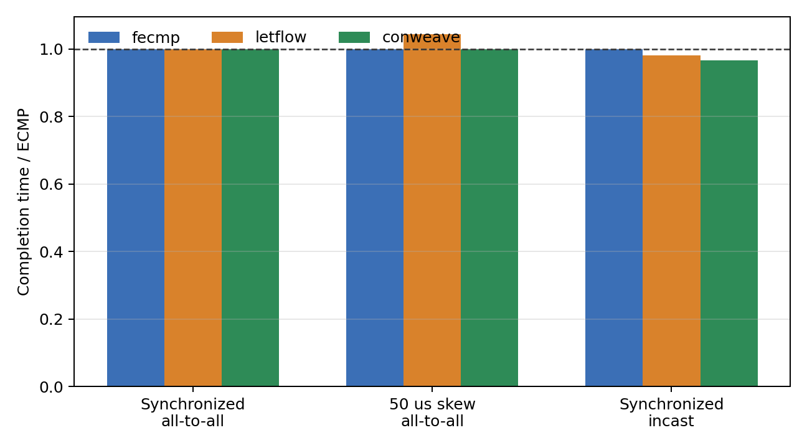
  <p><strong>Figure 8.</strong> Communication-phase completion time normalized to ECMP for the three HPC-style workloads. Values below 1 indicate an improvement over ECMP.</p>
</center>

<center>
  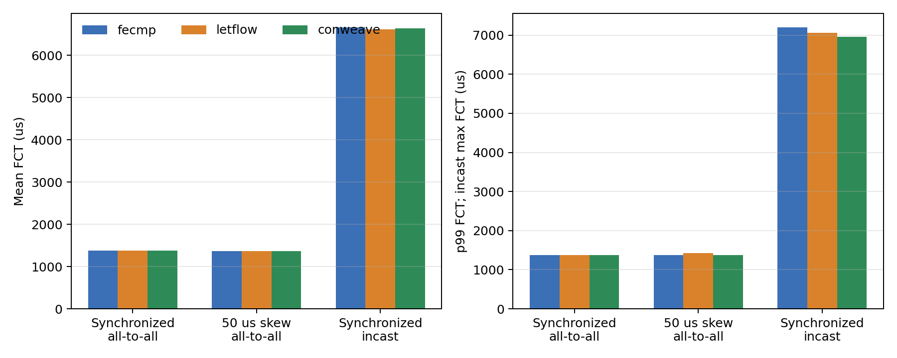
  <p><strong>Figure 9.</strong> Mean FCT (left) and tail FCT (right). The all-to-all tail is p99; the incast tail is the maximum of its 15 flows.</p>
</center>

**Conclusion from the initial comparison.** Synchronization alone is not sufficient to make ConWeave useful. It has no measurable effect when the fabric remains uncongested, as in the two 16-host all-to-all cases, but it provides a modest benefit when the communication pattern creates congestion that can be mitigated before the unavoidable destination bottleneck, as in the incast case.

### 5.4.3 Message-size follow-up: is a longer communication phase sufficient?

The synchronized all-to-all experiment was repeated with 4 MiB rather than 1 MiB per flow, while preserving the same 16 participants, placement, simultaneous start time, and Lossless RDMA configuration. ECMP, LetFlow, and ConWeave completed the phase in 5482.750 μs, 5482.762 μs, and 5482.746 μs, respectively, with differences below 0.0003%. All three runs recorded zero PFC and CNP events, while ConWeave recorded zero reroutes, out-of-order packets, and reorder occupancy. Increasing message size therefore extended the communication phase but did not create fabric congestion or activate ConWeave.

**Conclusion.** Increasing each flow from 1 MiB to 4 MiB makes the phase approximately four times longer but still leaves all congestion and ConWeave activity counters at zero. For this placement, communication duration alone is not sufficient to activate ConWeave. The limiting factor is the low simultaneous injection per rack, not the time for which each individual flow remains active.

### 5.4.4 Participant-scale follow-up: when does all-to-all activate ConWeave?

Scaling the synchronized workload to all 128 hosts produced substantially different behaviour from the 16-host experiments. All 16 servers in each rack were active simultaneously, placing direct pressure on the topology’s 2:1 oversubscribed fabric.

Because every flow starts at the same time, communication-phase completion time is equal to the maximum FCT in this experiment.

<table style="width:100%; border-collapse:collapse; margin:0.6em 0 1em; border-top:2px solid #000; border-bottom:2px solid #000; page-break-inside:avoid; break-inside:avoid; font-size:0.76em; line-height:1.15; table-layout:fixed;">
  <thead>
    <tr>
      <th style="width:16%; padding:0.38em 0.32em; text-align:left; border-bottom:1px solid #000;">Algorithm</th>
      <th style="width:24%; padding:0.38em 0.32em; text-align:right; border-bottom:1px solid #000;">Phase completion<br>(μs)</th>
      <th style="width:20%; padding:0.38em 0.32em; text-align:right; border-bottom:1px solid #000;">Relative to<br>ECMP</th>
      <th style="width:20%; padding:0.38em 0.32em; text-align:right; border-bottom:1px solid #000;">Mean FCT<br>(μs)</th>
      <th style="width:20%; padding:0.38em 0.32em; text-align:right; border-bottom:1px solid #000;">p99 FCT<br>(μs)</th>
    </tr>
  </thead>
  <tbody>
    <tr>
      <td style="padding:0.34em 0.32em; border-bottom:1px solid #d0d0d0;">ECMP</td>
      <td style="padding:0.34em 0.32em; text-align:right; white-space:nowrap; border-bottom:1px solid #d0d0d0;">100302.818</td>
      <td style="padding:0.34em 0.32em; text-align:right; white-space:nowrap; border-bottom:1px solid #d0d0d0;">1.000000</td>
      <td style="padding:0.34em 0.32em; text-align:right; white-space:nowrap; border-bottom:1px solid #d0d0d0;">79629.612</td>
      <td style="padding:0.34em 0.32em; text-align:right; white-space:nowrap; border-bottom:1px solid #d0d0d0;">95741.257</td>
    </tr>
    <tr>
      <td style="padding:0.34em 0.32em; border-bottom:1px solid #d0d0d0;">LetFlow</td>
      <td style="padding:0.34em 0.32em; text-align:right; white-space:nowrap; border-bottom:1px solid #d0d0d0;">118989.807</td>
      <td style="padding:0.34em 0.32em; text-align:right; white-space:nowrap; border-bottom:1px solid #d0d0d0;">1.186306</td>
      <td style="padding:0.34em 0.32em; text-align:right; white-space:nowrap; border-bottom:1px solid #d0d0d0;">83733.353</td>
      <td style="padding:0.34em 0.32em; text-align:right; white-space:nowrap; border-bottom:1px solid #d0d0d0;">116348.737</td>
    </tr>
    <tr>
      <td style="padding:0.34em 0.32em;">ConWeave</td>
      <td style="padding:0.34em 0.32em; text-align:right; white-space:nowrap;">98278.335</td>
      <td style="padding:0.34em 0.32em; text-align:right; white-space:nowrap;">0.979816</td>
      <td style="padding:0.34em 0.32em; text-align:right; white-space:nowrap;">84123.552</td>
      <td style="padding:0.34em 0.32em; text-align:right; white-space:nowrap;">97110.551</td>
    </tr>
  </tbody>
</table>

LetFlow increased phase-completion time by 18.63% relative to ECMP. Default ConWeave reduced it by 2.02%, making ConWeave the best of the three default configurations.

The individual-flow statistics reveal a more nuanced result. Relative to ECMP, ConWeave’s mean FCT was 5.64% higher and its p99 was 1.43% higher, even though its maximum FCT and complete phase duration were 2.02% lower. ConWeave therefore did not improve the majority of individual flows. Its application-level benefit was concentrated in the extreme tail beyond p99: the final straggler completed sooner.

ConWeave also produced 48.57% fewer PFC pause records and 29.31% fewer CNP events than ECMP. Its measured uplink imbalance was 1.655%, compared with 17.176% for ECMP and 33.820% for LetFlow. These measurements are consistent with more even use of the available paths and less congestion propagation, but they do not by themselves establish that either metric caused the completion-time improvement.

<center style="page-break-inside:avoid; break-inside:avoid;">
  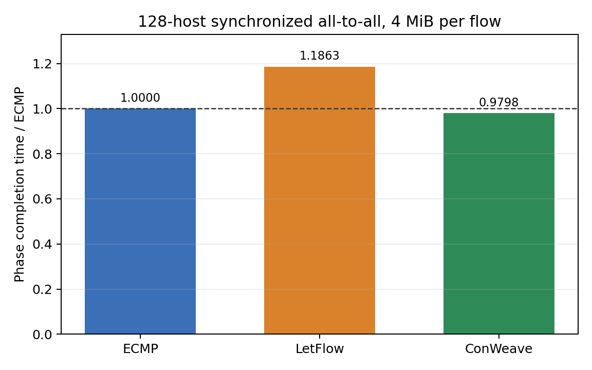
  <p><strong>Figure 10.</strong> Communication-phase completion time for the 128-host synchronized 4 MiB all-to-all workload, normalized to ECMP. LetFlow is 18.63% slower than ECMP, while default ConWeave is 2.02% faster.</p>
</center>

**Conclusion.** Scaling from two active hosts per rack to all 16 active hosts per rack changes the result qualitatively. In the tested topology, participant density and instantaneous offered load are the conditions that activate ConWeave. Default ConWeave improves the collective completion time by 2.02%, but not the mean or p99 FCT. Its benefit is therefore specifically a reduction of the final straggler, not a general acceleration of individual flows. This also shows why communication-phase completion time is the appropriate primary metric for synchronized collectives.

### 5.4.5 Reply-timeout sensitivity: does reaction speed determine the benefit?

Default ConWeave recorded substantial rerouting activity, so the reply-timeout sensitivity experiment was executed. The implementation defines the reply deadline as the inter-rack base RTT plus an extra timeout. The base RTT is 4 μs, giving effective deadlines of 6, 8, and 12 μs for the aggressive, default, and conservative configurations.

<table style="width:100%; border-collapse:collapse; margin:0.6em 0 1em; border-top:2px solid #000; border-bottom:2px solid #000; page-break-inside:avoid; break-inside:avoid; font-size:0.78em; line-height:1.15; table-layout:fixed;">
  <thead>
    <tr>
      <th style="width:18%; padding:0.38em 0.32em; text-align:left; border-bottom:1px solid #000;">Setting</th>
      <th style="width:15%; padding:0.38em 0.32em; text-align:right; border-bottom:1px solid #000;">Extra<br>timeout</th>
      <th style="width:17%; padding:0.38em 0.32em; text-align:right; border-bottom:1px solid #000;">Effective<br>deadline</th>
      <th style="width:22%; padding:0.38em 0.32em; text-align:right; border-bottom:1px solid #000;">Phase completion<br>(μs)</th>
      <th style="width:14%; padding:0.38em 0.32em; text-align:right; border-bottom:1px solid #000;">Relative to<br>default</th>
      <th style="width:14%; padding:0.38em 0.32em; text-align:right; border-bottom:1px solid #000;">Relative to<br>ECMP</th>
    </tr>
  </thead>
  <tbody>
    <tr>
      <td style="padding:0.34em 0.32em; border-bottom:1px solid #d0d0d0;"><strong>Aggressive</strong></td>
      <td style="padding:0.34em 0.32em; text-align:right; border-bottom:1px solid #d0d0d0;">2 μs</td>
      <td style="padding:0.34em 0.32em; text-align:right; border-bottom:1px solid #d0d0d0;">6 μs</td>
      <td style="padding:0.34em 0.32em; text-align:right; border-bottom:1px solid #d0d0d0;"><strong>97139.103</strong></td>
      <td style="padding:0.34em 0.32em; text-align:right; border-bottom:1px solid #d0d0d0;">−1.159%</td>
      <td style="padding:0.34em 0.32em; text-align:right; border-bottom:1px solid #d0d0d0;">−3.154%</td>
    </tr>
    <tr>
      <td style="padding:0.34em 0.32em; border-bottom:1px solid #d0d0d0;">Default</td>
      <td style="padding:0.34em 0.32em; text-align:right; border-bottom:1px solid #d0d0d0;">4 μs</td>
      <td style="padding:0.34em 0.32em; text-align:right; border-bottom:1px solid #d0d0d0;">8 μs</td>
      <td style="padding:0.34em 0.32em; text-align:right; border-bottom:1px solid #d0d0d0;">98278.335</td>
      <td style="padding:0.34em 0.32em; text-align:right; border-bottom:1px solid #d0d0d0;">0.000%</td>
      <td style="padding:0.34em 0.32em; text-align:right; border-bottom:1px solid #d0d0d0;">−2.018%</td>
    </tr>
    <tr>
      <td style="padding:0.34em 0.32em;">Conservative</td>
      <td style="padding:0.34em 0.32em; text-align:right;">8 μs</td>
      <td style="padding:0.34em 0.32em; text-align:right;">12 μs</td>
      <td style="padding:0.34em 0.32em; text-align:right;">101961.598</td>
      <td style="padding:0.34em 0.32em; text-align:right;">+3.748%</td>
      <td style="padding:0.34em 0.32em; text-align:right;">+1.654%</td>
    </tr>
  </tbody>
</table>

<table style="width:100%; border-collapse:collapse; margin:0.6em 0 1em; border-top:2px solid #000; border-bottom:2px solid #000; page-break-inside:avoid; break-inside:avoid; font-size:0.72em; line-height:1.15; table-layout:fixed;">
  <thead>
    <tr>
      <th style="width:15%; padding:0.38em 0.28em; text-align:left; border-bottom:1px solid #000;">Setting</th>
      <th style="width:18%; padding:0.38em 0.28em; text-align:right; border-bottom:1px solid #000;">Rerouting<br>counter</th>
      <th style="width:18%; padding:0.38em 0.28em; text-align:right; border-bottom:1px solid #000;">OoO packets</th>
      <th style="width:16%; padding:0.38em 0.28em; text-align:right; border-bottom:1px solid #000;">Max active<br>queues</th>
      <th style="width:16%; padding:0.38em 0.28em; text-align:right; border-bottom:1px solid #000;">Max reorder<br>packets</th>
      <th style="width:17%; padding:0.38em 0.28em; text-align:right; border-bottom:1px solid #000;">Timeout<br>flushes</th>
    </tr>
  </thead>
  <tbody>
    <tr>
      <td style="padding:0.34em 0.28em; border-bottom:1px solid #d0d0d0;">2 μs</td>
      <td style="padding:0.34em 0.28em; text-align:right; border-bottom:1px solid #d0d0d0;">9,841,406</td>
      <td style="padding:0.34em 0.28em; text-align:right; border-bottom:1px solid #d0d0d0;">4,233,773</td>
      <td style="padding:0.34em 0.28em; text-align:right; border-bottom:1px solid #d0d0d0;">1,448</td>
      <td style="padding:0.34em 0.28em; text-align:right; border-bottom:1px solid #d0d0d0;">4,104</td>
      <td style="padding:0.34em 0.28em; text-align:right; border-bottom:1px solid #d0d0d0;">246,809</td>
    </tr>
    <tr>
      <td style="padding:0.34em 0.28em; border-bottom:1px solid #d0d0d0;">4 μs</td>
      <td style="padding:0.34em 0.28em; text-align:right; border-bottom:1px solid #d0d0d0;">9,058,616</td>
      <td style="padding:0.34em 0.28em; text-align:right; border-bottom:1px solid #d0d0d0;">4,551,286</td>
      <td style="padding:0.34em 0.28em; text-align:right; border-bottom:1px solid #d0d0d0;">1,304</td>
      <td style="padding:0.34em 0.28em; text-align:right; border-bottom:1px solid #d0d0d0;">3,710</td>
      <td style="padding:0.34em 0.28em; text-align:right; border-bottom:1px solid #d0d0d0;">444,862</td>
    </tr>
    <tr>
      <td style="padding:0.34em 0.28em;">8 μs</td>
      <td style="padding:0.34em 0.28em; text-align:right;">8,057,822</td>
      <td style="padding:0.34em 0.28em; text-align:right;">5,188,952</td>
      <td style="padding:0.34em 0.28em; text-align:right;">1,510</td>
      <td style="padding:0.34em 0.28em; text-align:right;">3,665</td>
      <td style="padding:0.34em 0.28em; text-align:right;">621,050</td>
    </tr>
  </tbody>
</table>
The aggressive 2 μs-extra configuration achieved the lowest completion time: 1.16% below default ConWeave and 3.15% below ECMP. The conservative 8 μs-extra configuration was 3.75% slower than default and 1.65% slower than ECMP.

The relationship is not explained by reroute count alone. The aggressive configuration produced the largest rerouting counter, but it also recorded fewer out-of-order packet enqueues and 44.5% fewer timeout-triggered VOQ flushes than the default. Conversely, the conservative configuration performed fewer reroutes but recorded more out-of-order packets and 39.6% more timeout-triggered flushes than default.

PFC and CNP totals changed very little across the three settings. The result is therefore consistent with the timing and completion of rerouting transitions being more important than the total volume of congestion feedback. However, the experiment does not establish a causal relationship, and the simulator’s rerouting counter should not be interpreted as the number of distinct flows rerouted.
<center style="page-break-inside:avoid; break-inside:avoid;">
  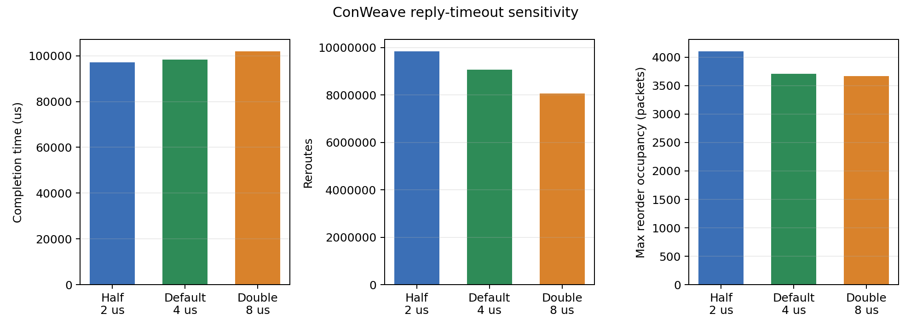
  <p><strong>Figure 11.</strong> ConWeave reply-timeout sensitivity for the full 128-host workload. The panels show communication-phase completion time, the simulator’s rerouting counter, and maximum reorder-buffer occupancy. Each value comes from one deterministic run.</p>
</center>

**Conclusion.** Within the three tested settings, the aggressive 6 μs effective deadline is best: it improves phase completion by 3.15% over ECMP and by 1.16% over default ConWeave. The conservative 12 μs deadline removes the advantage and becomes 1.65% slower than ECMP. The ordering is not explained by reroute count alone; it is more consistent with whether rerouting transitions complete promptly, since the aggressive setting has fewer out-of-order enqueues and substantially fewer timeout-triggered flushes. These runs do not establish that 6 μs is a generally optimal value, but they do show that the congestion-detection timescale can determine whether ConWeave helps or hurts a short synchronized phase.

### 5.4.6 Answers to the research questions

1. **Effect of communication pattern.** ConWeave is not automatically beneficial under synchronized traffic. It has no measurable effect in the uncongested 16-host all-to-all workloads, but it improves synchronized incast completion by 3.34% while reducing PFC pauses. The useful case is therefore not synchronization by itself, but synchronization that creates congestion on paths that can still be changed.

2. **Effect of communication intensity and participant scale.** Increasing message size from 1 MiB to 4 MiB without increasing the number of participants does not activate ConWeave. Scaling the same 4 MiB pattern to all 128 hosts does activate it and reduces collective completion by 2.02% with the default timeout. In this experiment, participant density and per-rack injection are more important than message duration alone.

3. **Effect of congestion-detection responsiveness.** The full-scale result is parameter-sensitive. A shorter reply deadline improves the gain from 2.02% to 3.15% relative to ECMP, whereas a longer deadline makes ConWeave 1.65% slower than ECMP. ConWeave must therefore react on a timescale short enough relative to the congestion episode and the collective phase.

> **Main conclusion of the extension:** ConWeave is not a universally better choice for HPC collective traffic. In these experiments, it is useful when three conditions hold together: the workload creates reroutable fabric congestion, enough participants inject traffic concurrently to activate the mechanism, and congestion is detected quickly enough. When these conditions hold, the main benefit is a shorter collective tail—the final straggler—rather than lower mean or p99 FCT. Because each configuration was executed once with a deterministic trace, this conclusion applies to the tested configurations and should not be interpreted as a statistically general performance guarantee.

## 5.5 Limitations

The extension should be interpreted as an exploratory evaluation because:

- **Single deterministic run per configuration:** seed sensitivity was not measured, and confidence intervals cannot be reported.
- **Single topology and transport mode:** all extension experiments use one leaf-spine topology and Lossless RDMA. Full-scale IRN behaviour was not evaluated.
- **Limited full-scale workload coverage:** the 128-host experiment uses one synchronized 4 MiB all-to-all trace. Other message sizes, start-time skews, participant mappings, and background workloads were not tested at full scale.
- **Synthetic communication patterns:** the traces model collective-like traffic rather than complete MPI implementations or application executions.
- **Implementation-level counters:** the ConWeave rerouting counter is extremely large and should not be interpreted as the number of distinct flows rerouted. The simulator exposes aggregate counters rather than per-flow rerouting histories.
- **No causal congestion-control tracing:** total PFC and CNP counts do not reveal whether feedback originated before or after a reroute or how sender rates evolved over time.

Consequently, the full-scale results demonstrate workload and parameter sensitivity but do not establish a statistically general optimal timeout or a complete causal explanation of ConWeave’s behaviour.

# 6. Reproducibility Assessment of the Paper

The paper explains its evaluation methodology clearly. It specifies the topology, workload distributions, RDMA configurations, compared load-balancing schemes, and main performance metric, which is sufficient to understand the purpose and configuration of the reproduced experiments.

The artifact provides the NS-3 implementation, topology files, traffic generator, execution scripts, and post-processing tools needed to reproduce the main results. However, it was not immediately compatible with the modern host environment. Its NS-3.19 and legacy Python dependencies required a compatible Docker container, while the supplied `autorun.sh` script required a final `wait` command to reliably track the completion of its background processes.

Execution time was another practical limitation. The eight simulations required for the 50% load experiment took approximately 12 hours on the available six-core workstation, which prevented the additional 80% load case from being reproduced within the project timeframe.

Overall, the artifact is usable and contains the main components required for reproduction. The selected experiment was reproducible with moderate setup and debugging effort, with software-version compatibility and execution time representing the main difficulties rather than missing experimental components.

# 7. Conclusion

The reproduction supports the paper’s principal qualitative claim. At 50% load, ConWeave achieved the lowest measured average and p99 FCT slowdown under both Lossless and IRN RDMA. Its improvements over CONGA were smaller than the minimum improvements reported in the paper, but the same ranking and the stronger benefit for tail latency were preserved. Because each configuration used one fixed-seed run, repeated experiments would be required to determine whether the numerical differences are systematic.

The HPC extension shows that ConWeave’s effect depends on both congestion structure and participant scale. It provided no measurable advantage in the 16-host synchronized all-to-all experiments, even when the message size was increased from 1 MiB to 4 MiB, because those workloads produced no PFC, CNP, rerouting, or reordering activity. In contrast, the full 128-host all-to-all workload activated ConWeave extensively. Default ConWeave reduced collective completion time by 2.02% relative to ECMP, while LetFlow was 18.63% slower. The improvement was concentrated in the final straggler rather than in mean or p99 FCT, showing that application-level collective completion and individual-flow statistics can lead to different conclusions.

The timeout-sensitivity experiment further showed that rerouting aggressiveness matters during collective bursts. Reducing the extra reply timeout from 4 μs to 2 μs improved completion time by a further 1.16%, producing a 3.15% improvement over ECMP, whereas increasing it to 8 μs made ConWeave 1.65% slower than ECMP. Together with the incast and skewed all-to-all results, these experiments indicate that ConWeave is most useful when the workload creates path congestion that can be mitigated and when its detection threshold reacts quickly enough to the duration of the communication phase.